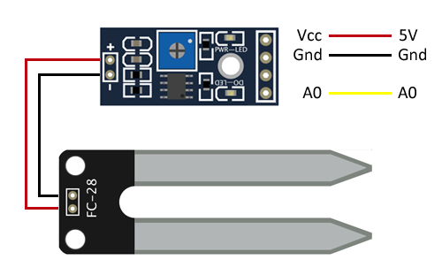
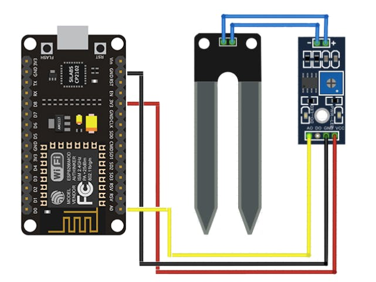

# Horizontes

## Alcance del proyecto
este proyecto quiere mostrar cómo conectar un NodeMCU con ThingSpeak y luego graficar los datos en una página web para lo que vamos a enviar el estado del sensor hl-69 y una variable random para luego graficar el resultado en html

## Herramientas a utilizar
- Arduino IDE
- NodeMCU
- HL-69
- ThingSpeak
- Html
- Bootstrap 4 (Es usado para darle los estilos a lo que se hará en Html)

## Esquemas de conexión del Hardware
Conexión del HL-69 con el LM393

Conexion del HL-69 con el NodeMCU
